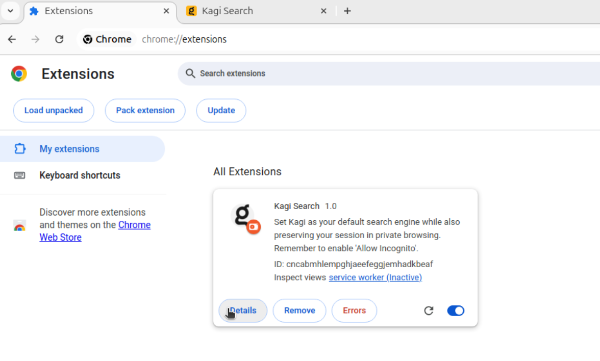
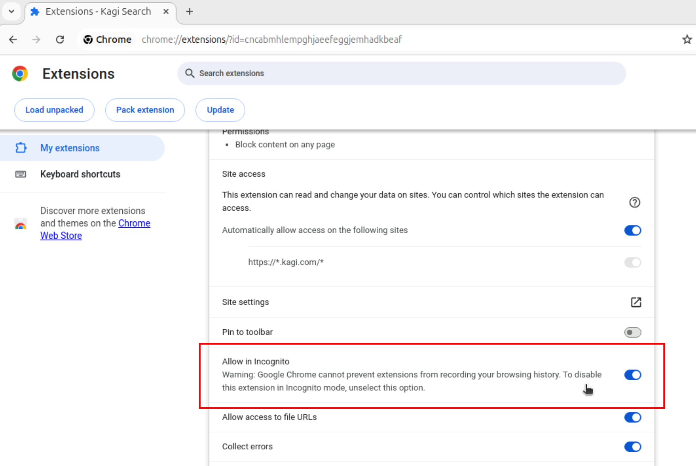
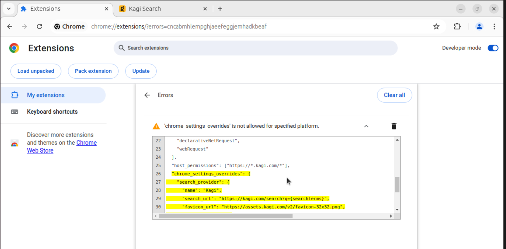
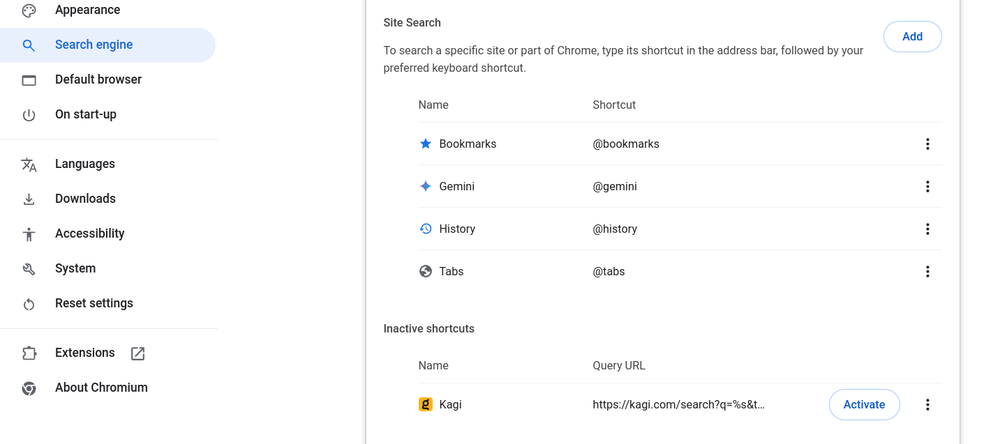
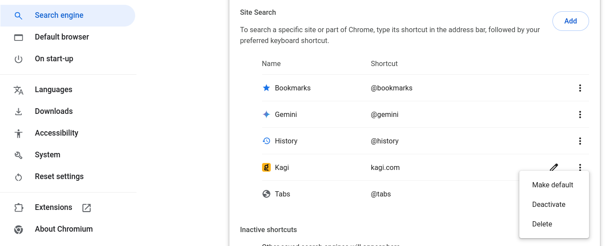
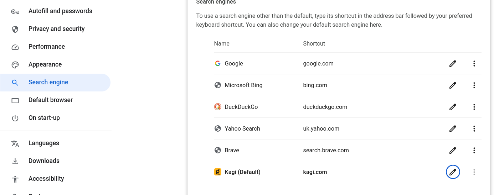
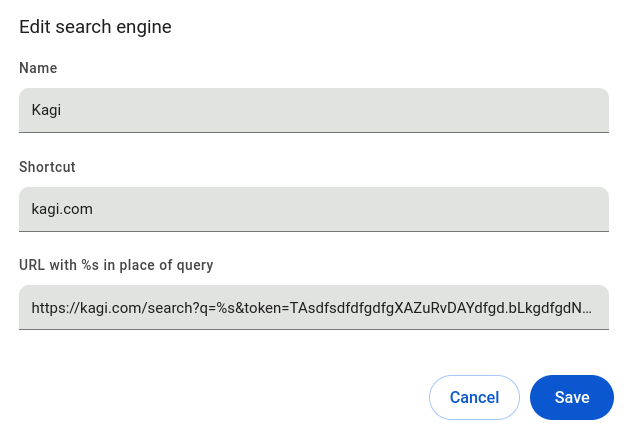

# Kagi Chrome Extension

This enables basic Kagi features for your Chromium browser (Chrome, Brave, Edge, Opera, [etc.](https://en.wikipedia.org/wiki/Chromium_(web_browser)#Browsers_based_on_Chromium)).

Install from the [Chrome Web Store](https://chrome.google.com/webstore/detail/kagi-search-for-chrome/cdglnehniifkbagbbombnjghhcihifij)

## Features
- Sets Kagi as your default search engine
- Preserves your login across private browsing
- Search-by-image by right-clicking on an image

## Additional Features
Kagi has many more features to offer, unfortunately due to [Google Web Store Policies](https://developer.chrome.com/docs/webstore/troubleshooting/#single-use) these must be provided by a separate extension.

This extension is not yet available.

## Setup
  1. Navigate to the extension's settings page `chrome://extensions`
  1. Click `Details` on the Kagi Search Extension 
  2. Scroll down and enable `Allow in Incognito` 

## Permissions
- `Block content on any page`
  - The Kagi extension only ever works on Kagi.com, see the code for yourself. This permission is unfortunately named.

## Platform Limitations
As per [Google's Docs](https://developer.chrome.com/docs/extensions/reference/manifest/chrome-settings-override) the API to change the default serarch engine is only available on Windows and Mac.

Accordingly, if you are developing the extension on Linux you may see the below error, which is safe to ignore.

## Setting Default Search on Linux
Note that unfortunately, this does not provide autocompleting search features.

1. Navigate to [kagi.com](https://kagi.com) and if necessary, sign in.
2. Navigate to `chrome://settings/searchEngines`.
3. In the section `Inactive shortcuts` click `Activate` on the Kagi entry. 
4. Now that Kagi has moved to the `Site Search` section, open the side menu and click `Make default`. 
5. Kagi will now be in the `Search Engines` section. 
6. For added privacy, click the 'pencil' icon to edit the Kagi entry. Replace the bottom field with `https://kagi.com/search?q=%s`. This step is not necessary but is recommended. 
